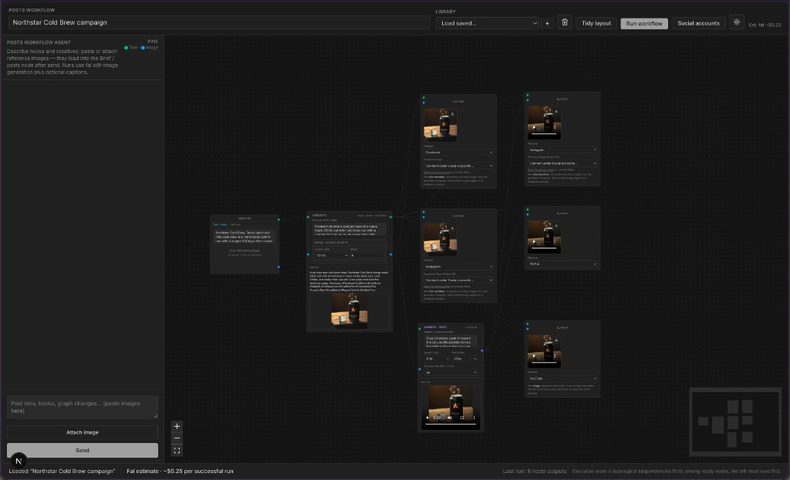

# Native Gen

Native Gen is a visual node-graph editor for social-creative pipelines. You brief an agent in natural language; the agent reads and rewrites the canvas; the runner generates images and short video, drafts captions, and either publishes to your connected accounts or hands you a clean export bundle.

Built for the Cursor Buildathon.



## The idea

The interesting bet behind Native Gen is about how to expose things to an AI agent.

We think of a social campaign as a small set of **primitives** — a brief, a generation step, an optional video step, a platform target — that snap together like building blocks on a canvas. The whole graph is just one JSON document.

Instead of giving the agent an opinionated toolbelt (`add_node`, `connect_edge`, `relabel_node`, …), we gave it two primitives: read the document, write the document. That's the whole API. The agent edits the same JSON the runtime executes, so:

- Any change — rename, rewire, replace, build from scratch — is one round-trip.
- The schema is the contract; validation errors map straight back to the data.
- Adding a new kind of block doesn't mean teaching the agent a new tool.

Same idea as Unix exposing files and pipes instead of "document objects": give the model the primitives, let it compose.

## Run it locally

```bash
npm install
cp .env.example .env.local
npm run dev
```

Open [http://localhost:3000](http://localhost:3000).

You only need `FAL_KEY` and `OPENAI_API_KEY` to use the canvas. OAuth keys are only needed if you want to publish directly to YouTube or Meta — without them you can still run workflows and download the export bundle.

## Environment variables

Copy `.env.example` to `.env.local` and fill in what you need:

| Variable | Required for | Purpose |
| --- | --- | --- |
| `FAL_KEY` | core | Media generation. |
| `OPENAI_API_KEY` | core | The workflow agent. |
| `GOOGLE_CLIENT_ID` / `GOOGLE_CLIENT_SECRET` | optional | YouTube publishing. |
| `META_APP_ID` / `META_APP_SECRET` | optional | Facebook + Instagram publishing. |
| `NEXT_PUBLIC_APP_URL` | optional | Public URL used in OAuth redirects. |
| `NATIVE_GEN_GATE_SECRET` | optional | Gate the demo behind a shared secret. |

## Pitch deck

Open [`pitchdesk/index.html`](pitchdesk/index.html) in a browser for the slide deck. Speaker notes live in [`docs/pitch-deck.md`](docs/pitch-deck.md).
